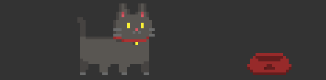

# About My Pet Tamagacha
  
Meet Tama, the virtual cat 😼  
My Pet Tamagacha is a virtual pet made entirely using java with java swing.
This program simulates a virtual pet that can move around on the screen and interact with its environment. Inspired by Tamagotchi.
 
## Features
As for now, the features and Tama's interaction is pretty limited, but I'm planning to add more in the future as I learn more as a programmer and an artist.
Some interaction and behavior available as of right now includes:
- 🐈 Tama will walk around the screen with a random interval of times
- 😼 Tama will 'meow' if you clicked on it (currently it only prints "miaw" on the terminal)
- 🐱‍👓 Tama can eat if her bowl is not empty
- 🍽️ Tama's bowl can be refilled by clicking on the empty bowl
- 🐱‍🏍Tama can be dragged around the screen (if she gets dragged outside the screen, she will simply walk back)
- 🛏️ Tama will sleep if she's tired
<<<<<<< HEAD
- 🐱‍💻More will be added soon... 🐾🐾🐾🐾🐾
=======
- 🐱‍💻More will be added soon... 🐾🐾🐾🐾🐾
>>>>>>> 44b36930ea1c8791ec423751abf2a6616bda0f76
